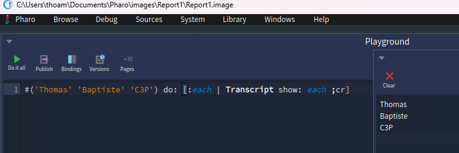

# DEVINCK Thomas

## 1) Learn about collections in Pharo and their iterators

### _What is a collection and what is it used for ? What kind of collections does Pharo standard library provide? How do you iterate collections and what are differences between them? How did you find this information?_

  Une collection est un objet qui contiens plusieurs objets apellée élément. Il est possible d'effectuer des opérations différentes (ajout,suppression,test ...) sur les collections.La particularité de Pharo sur celle-ci est que l'index commence à 1 et non à 0 comme sur d'autres languages. Il existe différentes collection qui  hérite d'une API commune étant 'Collection'.C 'est souvent utilisé pour stocker des données liées.

  En Pharo il existe différent types de collection.Il y'a les collections séquencable et les collections de hashage. 
  Les plus courantes sont les suivantes :
        - OrderedCollection (collection dont les éléments sont ordonnés)
        - Array (collection de taille fixe)
        - Set (collection sans doublon)
        - Dictionary (table de hashage clé-valeur)
    
  Pour itérer une collection il y'a différentes manières de faire. Voici la plus courante :
    
  `do: aBlock` qui itère chaque éléments d'une collection

  

  il existe également d'autre facon d'itérer comme :
        - `collect: aBlock` qui va renvoyer une collection qui aura appliquer la transofrmation
        
        - `select: aBlock` qui permet de fltrer selon une condition
        
        - `reject: aBlock` qui fait l'inverse de select (ne renvoie que ceux qui ne valide pas la condition)
        
        ... (`reverseDo`,`detect`)

##### Sources

  Les différentes réponses sont issues d'une compréhension de vidéo du mooc pharo (W3S7-FR) et également d'une video se nommant 'Programmation par objets : Les Collections' de Noury Bouraqadi.

## 2) Learn about conditionals in Pharo

### How do you write conditionals in Pharo? What is different from other programming languages? Can you think about the benefits and drawbacks of the approach? How did you find this information?

  En pharo les conditions sont des messages envoyés à des objets booléens ou à des objets blocs.

  il suffit d'écrire après les objets ` condition ifTrue: [aBlock] ` qui s'exécute si la condition est vraie ou `condition ifFalse: [aBlock]`  qui s'exécute si la condition est fausse mais également  ` condition ifTrue: [aBlock] ifFalse: [aBlock]` qui va execute le block du true si la condition est vérifiée sinon le block du ifFalse.

  Voici un exemple : 

  
  

  La différence avec les autres langages c'est que pharo n'utilise pas de mots-clés comme if et else avec une structure, c'est un message envoyée a un objet. L'avantage que je vois est une meilleur efficacité, sa execute que le bloc utile et permet d'éviter l'execution du else qui peut etre des fois inutile. L'inconvénient c'est la prise en main comme cela est différent des autres langages qu'on a l'habitude d'utiliser 

##### Sources
  J'ai trouver ces informations au sein de ce pdf : https://rmod-pharo-mooc.lille.inria.fr/OOPMooc/01-Welcome/W1S07-BasicBooleansAndCondition.pdf

## 3) Learn how to create classes and methods

### How do you write a small program with classes and methods in Pharo? Pharo is indeed, very IDE oriented and you have to get used to the tooling. How did you find this information? What program did you write? What problems did you find? Please provide a github repository link.

  Pour apprendre à créer une classe et des méthodes j'ai terminé l'exercice Counter commencer en cours

  Pour m'aider à créer ces classes et ses méthodes j'ai suivi les vidéos du mooc Pharo.

  J'ai rencontré différentes difficultées tel que l'adaptation au langage mais également le premier envoi vers GitHub car je n'avais pas de clé ssh et j'ai également eu un problème lors de la création du repository.

  Un bug a été remonté au projet pharo (setting the icerberg folder to .git/info leads to a mess #18519)(https://github.com/pharo-project/pharo/issues/18519)

  Voici le lien GitHub qui comporte mon premier exercice : https://github.com/thomasdvck/C3P_Counter

## 4) Learn about the basic Pharo coding style.

### Pharo methods are usually small and readable. What rules are common to follow? Are there tools that show you violations to such rules?

  En pharo, il y'a différentes régles de codage.

  Les noms des méthodes doivent être simple et compréhensible.

  Une méthode doit avoir une seule responsabilité et doit être assez courte avec peu de paramètre.

  Evitez au maximum les dupplications de code.

  Pharo a un outil intégré qui s'apelle critique browser, il montre les violations de bonne pratiques.

## 5) Extras

### Can you learn about cascades and block closures? How do you approach it?

  De ce que j'ai compris les cascades permettent d'envoyer plusieurs messages à la suite à un même objet sans devoir répeter le nom de l'objet

# Baptiste Delisle

## Document utilisé : 
    - Vidéo de Noury Bouraqadi (https://www.youtube.com/watch?v=ZjR33ekQMZE)

## Learn about collections in Pharo and their iterators
    Une collection est un objet qui référence un nombre arbitraire d'objets. Une collection est une notion plus générale qu'un "Tableau"

    Les différents type de collections contenue dans la bibliothèque standard de Pharo sont :
        - Collections ordonnées :
            - Taille fixe :
                - Array
            - Taille variable :
                - OrderedCollection
                - SortedCollection

        - Collections non ordonnées (Taille variable) :
            - Ensembles :
                - Set : Deux éléments ne peuvent pas être égaux 
                - IdentifySet (Un élément ne peut pas apparaitre deux fois)
            - Dictionnaires (Table de correspondance clé-valeur)
                - Dictionary (Deux clés ne peuvent pas être égales)
                - IdentityDictionnary (Une clé ne peut être utilisée deux fois)

    Les différentes boucles pour itérer sur une collection sont :
        //Pour faire un traitement sur chaque élément de la collection 
        - do: [:element | "traitements"]
            - element = variable qui référence successivement les différents éléments de la collection
            - les traitements définis dans le bloc sont exécutés successivement pour chaque éléments de la collection

        //Pour faire un traitement et récupérer le résulats de ce traitement pour chaque élément
        - Collect: [:element | "traitements"]
            - Retourne une collection du même type que celle parcourue
            - avec les résultats des traitements pour chaque élément 

        //Parcourir une Collection pour extraire une sous-collection qui vérifie une expression booléenne
        - select: [:element | "expression booléenne"]
            - Retourne les éléments pour lesquels l'expression booléenne est vraie

        //Parcourir une Collection pour extraire une sous-collection qui ne vérifie pas l'expression booléenne
        - reject: [:element | "expression booléenne"]
            - inverse du select

        //Pour faire comme un Do mais a l'envers
        - reverseDo: [:element | "traitements"]
            - Parcours la collection dans l'ordre inverse 
            - Pour les collections ordonnées seulement 

        //Rechercher un élément dans la collection
        - detect: [:element | "expression booléenne"]
            - Provoque une erreur si aucun élément est trouvé 
            //Pour gérer le cas où il y a une erreur
            - ifNone: ["traitements alternatifs"]
                - Retourne le premier élément pour lequel l'expression booléenne est vraie
                - Exécute le bloc de traitements alternatifs si l'expression booléenne est fausse pour tous les éléments

# Document utilisé : 
    - https://rmod-pharo-mooc.lille.inria.fr/MOOC/PharoMOOC-Videos/FR/Week2/C019SD-W2-S8-v2.mp4

# Learn about conditionals in Pharo
    Dans Pharo, les conditions traditionnelles (if, else, while) sont des messages envoyés à des objets booléens ou de type bloc.

    En Java, C, Python, etc., if/else sont des structures du langage.
    En Pharo, ce sont de simples méthodes définies sur true et false.
    true sait quoi faire avec ifTrue: (il exécute le bloc).
    false sait quoi faire avec ifTrue: (il ne fait rien).
    
    Les bénéfices sont : 
        - Il n'y a pas de syntaxe spéciale
        - Le code se lit de façon naturelle

    Les inconvénients : 
        - Pour un développeur qui a l'habitude de développer dans d'autres langages, ça peut paraitre étrange
        - Ecriture plus longue qu'avec if et else

# Learn how to create classes and methods

    FAIRE LE TP COUNTER regarder sur le github pour faire avec celui des autres ca sera plus rapide

# Learn about the basic Pharo coding style
    Dans Pharo, on insiste beaucoup sur la lisibilité et la simplicité.
    Quelques règles courantes :
        - Des méthodes petites
        - Une méthode doit tenir sur quelques lignes (idéalement 5 à 10).
        Si elle devient trop longue, il faut l’extraire en plusieurs méthodes.
        - Un seul niveau d’abstraction
        - Une méthode doit rester cohérente : soit elle exprime une idée de haut niveau, soit elle détaille une opération précise, mais pas les deux mélangés.
        - Pas de duplication de code
        - Si tu écris deux fois la même logique, extrais-la dans une nouvelle méthode.
        - Des noms explicites
        - Les noms de méthodes et de variables doivent exprimer clairement leur rôle.
        - Pas trop de paramètres
        - Si une méthode prend trop d’arguments, c’est souvent signe qu’il faut revoir la conception.

    Pharo fournit des outils comme Critics Browser (accessible depuis le système de navigation).
    Il permet de repérer des problèmes de style, par exemple :
        - méthodes trop longues,
        - variables temporaires inutilisées,
        - noms non conformes,
        - duplication de code.

# Learn how to create classes and methods
    J’ai développé la classe Counter ainsi que ses principales méthodes, en suivant l’exemple proposé dans le tutoriel de la première semaine. Le code est disponible dans ce dépôt : https://github.com/Bapt7781/C3P_Counter
    .

    J’ai rencontré quelques difficultés avec le dépôt GitHub que j’avais mis en place. Pour résoudre ce problème, j’ai demandé de l’aide à un camarade qui m’a expliqué la procédure à suivre.

  
  
