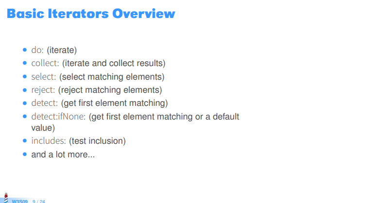
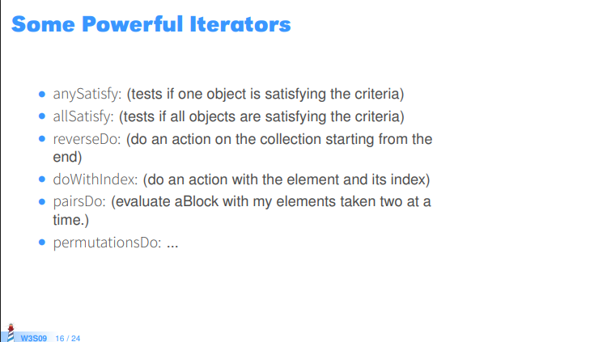
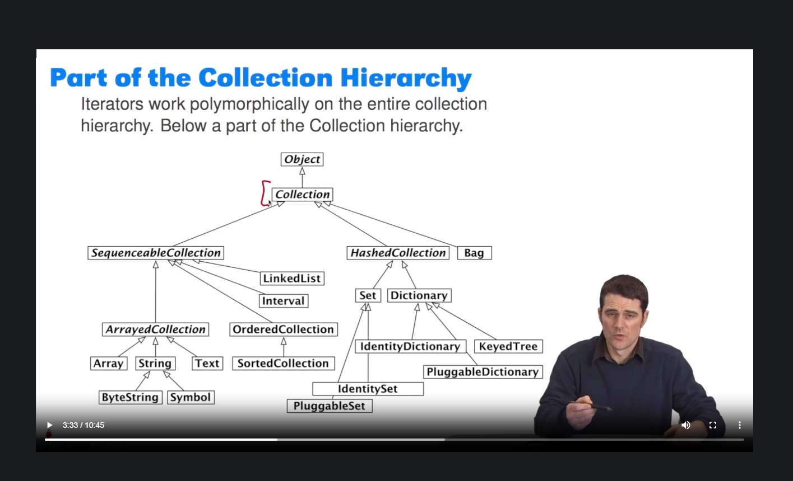
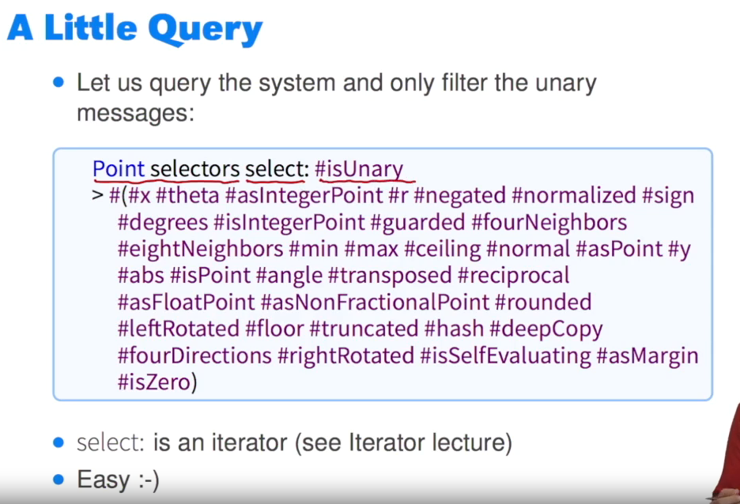
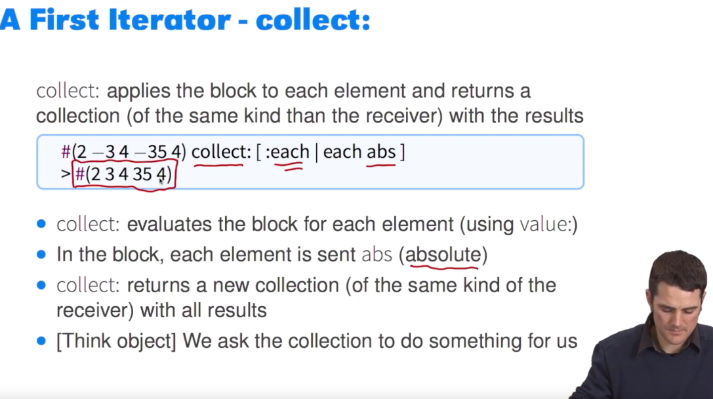
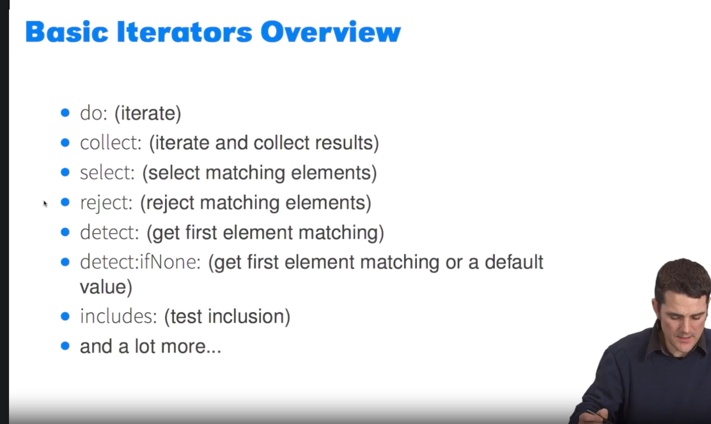
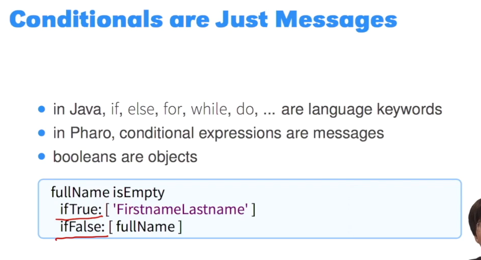
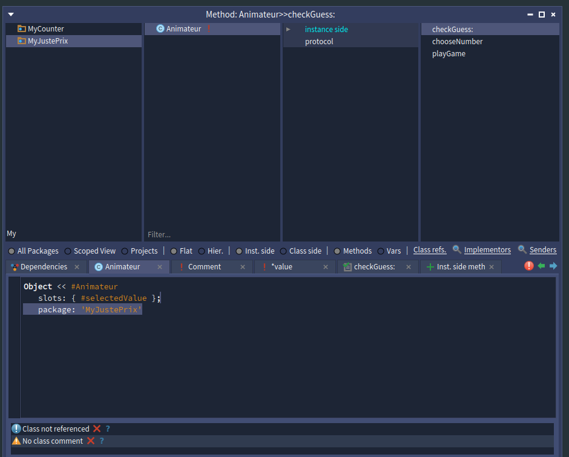
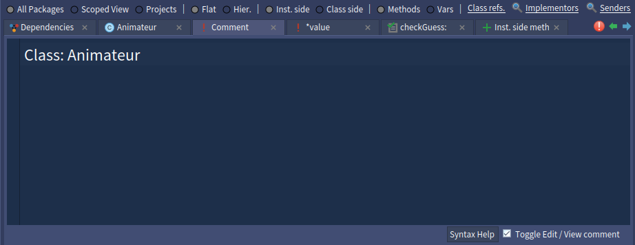
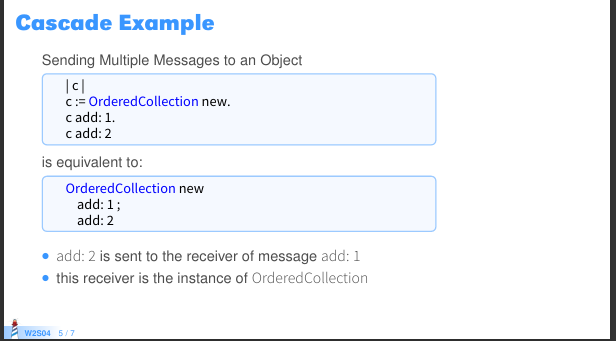

# Week 1 report

## Léo Defossez

### Learn about collections in Pharo and their iterators

> #### What is a collection and what is it used for?
> Une collection peut être utilisée pour stocker un nombre d'éléments non connu à l'avance.  
> De plus, les collections offrent souvent un moyen d'itérer sur chacun des éléments, ce qui permet d'écrire du code compact et réutilisable.
> 
> #### What kind of collections does Pharo standard library provide?
> 
>
> #### How do you iterate collections and what are differences between them?
> 
> 
> D'autres itérateurs peuvent existés, il suffit de parcourir les méthodes de la classe Collection dans Pharo.
> 
> #### How did you find this information?
> Chacune des captures d'écran ici sont récupérées du [pdf présent dans le Mooc](https://rmod-pharo-mooc.lille.inria.fr/MOOC/PharoMOOC/Week3/C019-W3S09-Iterators.pdf), abordant les itérateurs.

### Learn about conditionals in Pharo

> #### How do you write conditionals in Pharo?
> On utilise les messages ifTrue:ifFalse:, ou ifTrue: ou ifFalse: séparément.  
> **Un exemple de syntaxe:**
>```Smalltalk
>    true ifTrue: [doSomething] ifFalse: [doSomething]
>```
> #### What is different from other programming languages?
> À la différence d'autres langages, ici les conditionnels sont des messages envoyés aux booléens, comme tout autres messages envoyés à des objets.
> De plus, on utilise des blocs en arguments.
> #### Can you think about the benefits and drawbacks of the approach? 
> Je ne vois pas de problème dans cette approche, cependant, certains bénéfices sont présents :
> 1. L'utilisation de conditionnels étant sous le même format que tout autres appels de méthodes, la syntaxe ne diffère pas du reste du code.
> 2. L'utilisation de bloc permet à ces méthodes d'être *Lazy*
> 
> #### How did you find this information?
> Des [slides à ce propos](https://rmod-pharo-mooc.lille.inria.fr/MOOC/PharoMOOC/Week2/C019-W2S08-BooleansAndCondition.pdf) sont présents dans le MOOC.

### Learn how to create classes and methods

> #### What program did you write?
> J'ai écrit un "mini-jeu" sur [ce dépôt git](https://github.com/LeoDefossez/NTME_pharo/tree/master)
> Il n'est pas du tout interactif, très peu de choses sont présentes, mais cela contient des classes, méthodes et 3 tests
> #### What problems did you find? 
> Connaissant déjà pharo, je n'ai pas eu de problèmes particuliers


### Learn about the basic Pharo coding style

> ####  What rules are common to follow?
> 1. indenter le code des méthodes
> 2. ne pas nommer les setter de cette façon :   
> `setAttribute:`  
> mais plûtot de cette façon :  
> `attribute:`  
> 3. autres règles [ici](https://books.pharo.org/booklet-WithStyle/pdf/WithStyle.pdf)
> 
> #### Are there tools that show you violations to such rules?
> Oui, il y en a plusieurs, ceux que je rencontre les plus souvent sont :  
> 1. L'onglet se trouvant sous l'éditeur de méthodes
> 2. L'onglet apparaissant avant de commit  
> D'autres sont surement présents, mais je ceux-ci sont ceux que je rencontre les plus souvent. 

### Extras

> #### Can you learn about cascades and block closures?
> **Cascades**
> Exemple :
> ```Smalltalk
>    Transcript open;
>    clear;
>    nextPutAll: 'wow a tab just opened';
>    yourself.
>```
> Le charactère ';' permet d'envoyer des messages en cascades à un objet.  
> Dans le cas ici présents comme on écrit le premier ';' après open, la cascade sera réalisée sur l'objet Transcript. 
> Ce qui signifie que Transcript va effectuer les méthodes open, clear, nextPutAll: et yourself
> yourself permet de renvoyer l'objet initial sur lequel la cascade s'est réalisée, si nous avons besoin de le récupérer
> 
> **Block closure**
> Les blocks peuvent être apparentés à méthodes anonymes ou lambda methods. Ils ne s'exécutent que si nécessaire, ce qui permet de controller une execution. 

# Week 1 report

## Gautier Louvier

### Learn about collections in Pharo and their iterators

> #### What is a collection and what is it used for?
> 
> Une collection dans pharo: est un objet contenant d'autre objet on obtient donc une forme de stockage qui peut avoir certaines spécificité selon les cas d'usage. 
> 
> On peut aussi réaliser des boucles sur celle ci pour executer un bout de code sur chaque élément. 
> 
> 
> 
> #### What kind of collections does Pharo standard library provide?
> 
> On peut retrouver une multitude de collection j'ai trouvés dans les vidéos / slides cette images qui je pense sont les standard library.
> 
> 
> #### How do you iterate collections and what are differences between them?
> 
> On peut par exemple itéré en selection de maniere spécfique ce que l'ont veut garder avec "select:"  et avec une query specifique.
> 
> 
> 
> 
> 
> On peut aussi retrouver l'itérateur "collect:"  qui va récupérer par exemple tout les résultats d'un block pour le ranger dans une collections qui peut être return. 
> 
> 
> 
> #### How did you find this information?
> 
> Sur les screen dans la section du module 1. D'autre itérateur que j'ai trouvé sur les slides : 
> 
> 
> 
> 
> 
> 

### Learn about conditionals in Pharo

> #### How do you write conditionals in Pharo?
> 
>     Les conditions s'écrive comme des messages c'est à dire pour executer True  il faut envoyer le message "ifTrue" avec son argument donc ifTrue:Argument (c'est donc un keyword si j'ai bien compris)
> 
> 
> 
> J'ai pris l'exemple de True et False mais c'est la même chose avec for,while,do ect. . .
> 
> #### What is different from other programming languages?
> 
> On appel directement les messages respectif pour les boolean pour réaliser l'opération dessus. Avec IfFalse et IfTrue 
> 
> #### Can you think about the benefits and drawbacks of the approach?
> 
> Je dirais que ça évite de devoir apprendre une nouvelle syntaxe spécifique au condition, vu que ce sont des objets comme tout le reste et donc on intéragit de la même maniere avec eux. Je sais pas si on peut appeler ça un point négatif mais je dirais que par conséquent si ça ressemble à tout le reste c'est peut etre plus dur à detecter dans un grand code ? Sinon je ne vois pas trop d'inconvénients.
> 
> 
> 
> #### How did you find this information?
> 
> 
> 
> J'ai déduit ces informations avec ce slide.

### Learn how to create classes and methods

> #### What program did you write?
> 
> J'ai fais le petit programme Counter.
> 
> #### What problems did you find?
> 
> 

### Learn about the basic Pharo coding style

> #### What rules are common to follow?
> 
> On utilise le camelCase pour que ce soit cohérent.
> 
> 
> Une regle qui me paraissait intéressante aussi : 
> 
> 
> 
> #### Are there tools that show you violations to such rules?
> 
> On peut voir ça dans cette partie : 
> 
> 

# Week 1 Report 

## Xavier Moyon 

### Learn about collections in Pharo and their iterators

What is a collection and what is it used for?

Les collections sont des conteneurs, elles permettent de stocker des éléments de différentes façons et de les parcourir.

What kind of collections does Pharo standard library provide?

Pharo fournit différents types de collections, tels que les listes (Array), les dictionnaires et les Sets.

How do you iterate collections and what are differences between them?

On demande à la collection d'itérer sur elle même en utilisant les mots clefs suivants :
- `do` va parcourir le contenu de l'itérateur et éxécuter le bloc fourni pour chaques valeurs
- `collect` va parcourir le contenu de l'itérateur et éxécuter le bloc fourni pour chaques valeurs et retourner le résultat du bloc dans une nouvelle collection
- `select` permet de récupérer uniquement les éléments correspondant
- `reject` permet de sélectionner uniquement les éléments ne correspondant pas
- `detect` permet de sélectionner le premier élément correspondant
  ...
  How did you find this information?

Sur la vidéo suivante https://rmod-pharo-mooc.lille.inria.fr/MOOC/PharoMOOC-Videos/FR/Week3/C019SD-W3-S9-v3.mp4
Pour la définition, je me suis basé sur les liste en Java.


Do not hesitate to add in the report code examples that you tried.

### Learn about conditionals in Pharo

How do you write conditionals in Pharo?

On essaye d'utiliser le moins possible de conditions, on va préférer utiliser l'héritage en écrivant des méthodes spécifique pour chaque type.
Par exemple la méthode "not" de la classe Booléan est implémentée de manière différente pour les sous classes True et False.
Mais lorsque l'on doit écrire des conditions, on utilisera un message que l'on enverra à un receveur.

What is different from other programming languages?

Pour les autres langages, les conditions sont écrites avec une syntaxe particulières :
```java
if(condition){
    sayHello();
}
```

Tandis qu'avec pharo, les conditions fonctionnent comme une méthode classique, on envoie un message (:ifTrue ou ifFalse) à un receveur (True ou False) :
```pharo
|c|
c := Random new nextInteger: 30.
Transcript open.

(c between: 10 and:20)
ifTrue: [Transcript show: 'value is  between 10 and 20  - ' , c asString.]
ifFalse: [ Transcript show: 'value is not between 10 and 20'].
```


Can you think about the benefits and drawbacks of the approach?


How did you find this information? In the Following vidéo : 

https://rmod-pharo-mooc.lille.inria.fr/AdvancedDesignMooc/Videos/M01_S1.mp4

### Learn how to create classes and methods

How do you write a small program with classes and methods in Pharo?
Pharo is indeed, very IDE oriented and you have to get used to the tooling.

Pour commencer on créer un package si on en a pas déjà.
Ensuite sur ce package on va pouvoir ajouter une classe en faisant un clic droit > new class.
Ensuite, on va pouvoir nommer notre classe en remplaçant le champ "myClass". Puis pour créer une méthode on va pouvoir cliquer sur "Inst side meth"
How did you find this information?


What program did you write?

Un programme pour jouer au "Juste Prix" avec un animateur. Il manque encore un certains nombres de fonctionnalités cependant. On peut pour l'instant seulement choisir un nombre.

What problems did you find?

J'ai eu quelques difficultés pour prendre en mains l'interface de pharo.
J'ai aussi fait quelques erreurs en oubliant l'ordre des priorités des opérations.

Please provide a github repository link.

https://github.com/Moyon-Xavier/c3p-just-price


### Learn about the basic Pharo coding style.

Pharo methods are usually small and readable.
What rules are common to follow?

- Ne pas mettre trop d'instructions dans un bloc.
- Il faut indiquer le type des méthode (est-ce un accesseur, une méthode de calcul)
- Il n'est pas obligatoire de mettre un point sur la dernière instruction d'une méthode.
- Une classe/méthode est bien plus belle si elle est commentée.

Are there tools that show you violations to such rules?
Pour le type de méthode, un warning ce déclenche en si le type n'est pas défini mais n'empêche pas l'exécution
Please show code examples that violate some rules.

_Hint:_ look for the `Pharo with Style` free book.

### Extras

Can you learn about cascades and block closures?

Ceci est un exemple de cascade : 


How do you approach it?

Pour les casacdes, j'ai utilisé le pdf suivant : 


Did you ask questions in the discord channels or mailing lists?

This is extra points ;)

