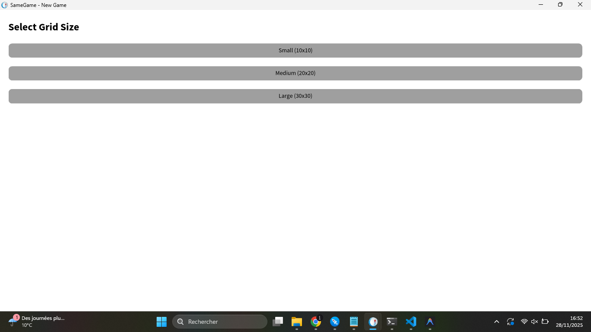

 # Rapport - Ait Ali Ilyas

Avancement de la semaine :

Cette semaine, je me suis concentré sur l'ajout de la fonctionnalité de tailles de grilles variables pour le SameGame.

J'ai commencé par analyser le code existant pour comprendre comment le plateau était généré. Ensuite,
 j'ai implémenté un menu d'accueil simple et intuitif (en utilisant Bloc) qui s'ouvre au lancement du jeu. Ce menu permet désormais au joueur de choisir entre trois tailles prédéfinies (Petite, Moyenne, Grande) ou de saisir une taille personnalisée.

J'ai veillé à garder le code propre et cohérent avec l'architecture du projet, et 
j'ai ajouté des tests unitaires pour garantir que les configurations de tailles fonctionnent correctement.

