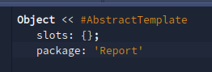
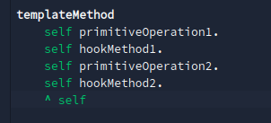
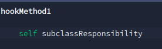
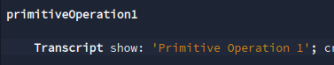
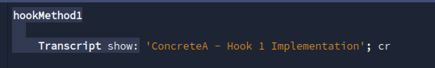
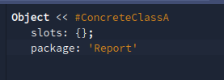

# Report - Alli Rayane
```
pour cette semaine, j'ai etablis mes devoirs autour des cours mis a dispostions et du KATA 2 cette fois-ci .
```
## KATA 
```
il y avais de nombreuses amelioration disponible pour notre roover mais j'ai trouver interressant de prendre en charge la marche arriere de notre robot.Cette derniere nous force a changer de nombreuse methode etablie au prealable.

ici la methode back :
```


```
puis la redefinition dans notre classe mere  et dans ses classes filles, exemple ici avec North: 
```


```
maintenant il ne nous reste plus qu'a adaptée notre interpretDirection pour que notre methode soit reconnu:
```


## reverse engineering 
```
Le reverse engineering consiste à comprendre un système mal documenté en commençant par une vue d'ensemble des composants et de leurs interactions. On utilise la navigation statique (références, expéditeurs) pour identifier les éléments clés sans se perdre dans les détails. L'analyse des conditions et des hiérarchies révèle les faiblesses de conception. Des techniques avancées  comme "Refactor to Understand"  permettent de renommer pour clarifier et refactorer progressivement. L'objectif est de pouvoir maintenir et étendre le système en comprenant son fonctionnement réel.


# Rapport Ilyas Aitali
```
J'ai approfondi le concept des Template Methods et Hooks en créant une classe AbstractTemplate avec une méthode templateMethod qui définit un algorithme  combinant des opérations et des hooks. 

Les méthodes hookMethod1 et hookMethod2, déclarées abstraites via subclassResponsibility, constituent les points de variation destinés à être implémentés par les sous-classes. J'ai ensuite développé ConcreteClassA  qui redéfinit spécifiquement ces hooks, démontrant ainsi comment le même squelette algorithmique peut produire des comportements différents selon les implémentations










Je me suis ensuite documenté sur le reverse engineering et de ce que j'ai compris cela consiste à analyser un code déjà  existant de manière méthodique, en bien retracant les appels des méthodes et des dépendances entre les classes pour comprendre la structure et le comportement d'un programme, même en l'absence de documentation. Ce qui permet d'explorer et de modifier un projet inconnu avec rigueur 
