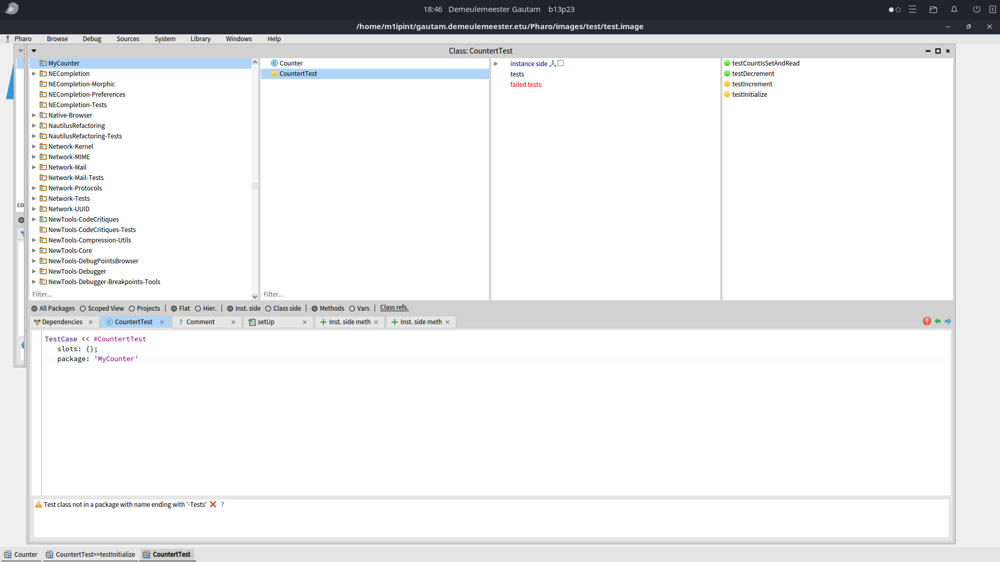
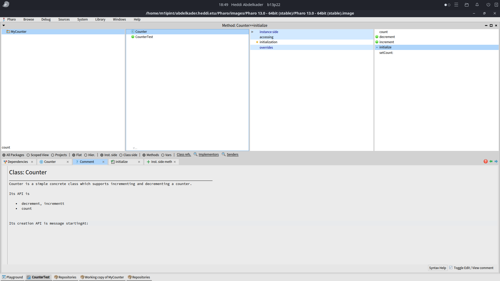

## Gautam Demeulemeester

J'ai terminé le premier TP sur la création de classes et de tests.
J'ai deux tests qui sont restés en jaune et je n'ai pas compris la raison.
J'ai qq difficultés à comprendre le fonctionnement de pharo mais je commence à l'apprivoiser petit à petit.

J'ai lu les pdf, j'ai bien compris le systeme de conditionnel/booleen. La partie heritage lookup/super à l'air plus compliquée bien que je la maitrise en java.
Je n'ai pas de question particulière pour l'instant.

## HEDDI Abdelkader

J'ai terminé le premier TP sur la création de la classe `Counter` comme vous pouvez le voir sur les captures d'écrans ci-dessous.

Ce TP m'a permis de comprendre le fonctionnement de base de Pharo et de son environnement, notamment la création de classes et de méthodes.

En étudiant le module 1 :

- J’ai découvert le système de collections et la manière de les parcourir. Cela m’a aidé à mieux comprendre comment organiser et manipuler des données en Pharo.

- J’ai aussi étudié les conditionnels qui permettent une syntaxe claire et cohérente. J'ai eu un peu de mal sur ces derniers car ils sont différents de ceux en java ou en python.

- La partie sur le style de code m’a montré l’importance d’écrire des méthodes courtes et lisibles. Je trouve cela intéressant car cela oblige à structurer son code de façon plus simple.

Je n’ai pas rencontré de blocages majeurs, même si l’adaptation à l’IDE de Pharo demande un peu de temps.

Je commence à prendre mes repères petit à petit et je comprends mieux la logique propre à Pharo.  
Pour l’instant, je n’ai pas de question particulière.

## Khalil BOUCHAMA

Durant la semaine du 3/09/2025 au 10/09/2025 j'ai terminé le tp n°1 sur la création d'un Compteur. 

